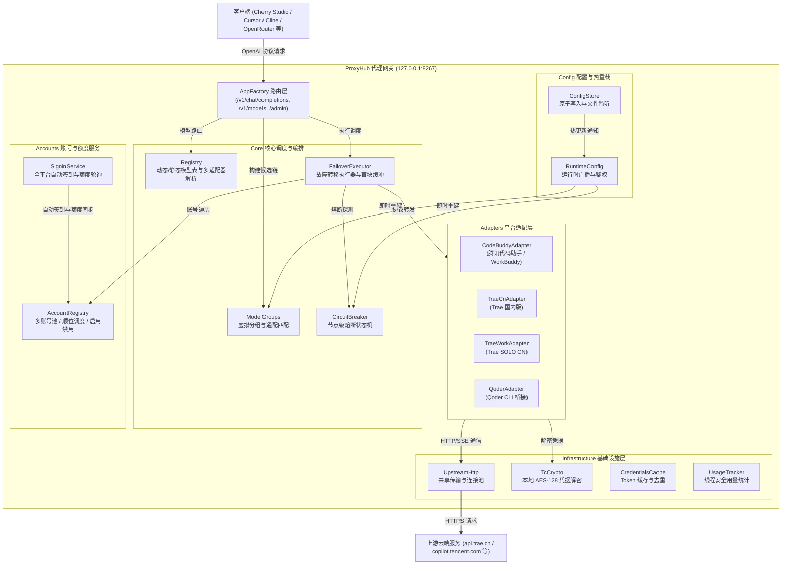
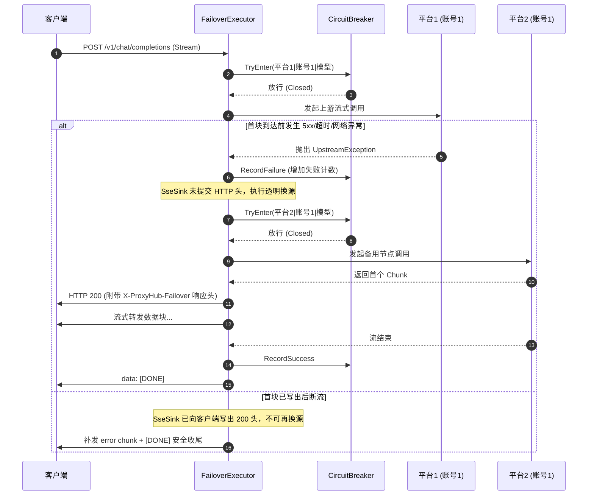

# ProxyHub 开发者架构与设计文档 (DEVELOPMENT.md)

本文档面向 **ProxyHub** 的开发者与维护者，详细阐述系统的分层架构、重构后的模块组织、核心业务调度机制、额度与自动签到设计以及新增平台适配器的开发规范。

---

## 一、 系统架构概览

ProxyHub 是一个基于 **.NET 10 / ASP.NET Core** 构建的高性能 AI 反向代理网关。其核心设计理念是**将本机多个主流 AI 编程平台的登录凭据、模型能力与额度统一封装为标准的 OpenAI API 接口**，并在此基础上提供**多账号轮次调度、跨平台故障转移、节点级熔断保护与可视化管理运维**。

### 1.1 分层架构图



---

## 二、 目录结构与模块说明

重构后，项目代码按**高内聚、低耦合**的领域模型划分为清晰的子目录：

```
ProxyHub/
├── Core/                      # 核心执行、路由与故障转移调度
│   ├── AppFactory.cs          # HTTP 路由出口、SSE/聚合流转与候选链构建
│   ├── CircuitBreaker.cs      # 节点级熔断状态机 (Closed -> Open -> Half-Open)
│   ├── FailoverExecutor.cs    # 故障转移执行器 (链遍历、首块缓冲、熔断联动)
│   ├── ModelGroups.cs         # 虚拟模型分组 (通配匹配、平台优先级展开)
│   └── Registry.cs            # 模型注册表、动态/静态两级模型表、能力矩阵
│
├── Accounts/                  # 账号发现、池化调度与自动签到服务
│   ├── AccountRegistry.cs     # 多账号池管理 (优先级顺位、启用/禁用、黑名单删除)
│   ├── AdapterAccount.cs      # 账号实体模型 (用户ID、积分、启用状态、排序字段)
│   └── SigninService.cs       # 全平台自动签到与额度轮询服务 (借鉴 cockpit-tools)
│
├── Adapters/                  # 平台协议适配器实现
│   ├── IAdapter.cs            # 适配器抽象契约接口
│   ├── CodeBuddyAdapter.cs    # 腾讯 CodeBuddy / WorkBuddy 协议适配
│   ├── TraeAdapterBase.cs     # Trae 系列基类 (伪装头、AES凭据解密、SQLite模型缓存)
│   ├── TraeCnAdapter.cs       # Trae 国内标准版
│   ├── TraeWorkAdapter.cs     # Trae SOLO CN / TraeWork 桌面版
│   └── QoderAdapter.cs        # 阿里/通义 Qoder CLI 桥接适配
│
├── Config/                    # 系统配置、持久化与热更新
│   ├── ProxyHubConfig.cs      # 配置 Schema 定义与默认值基线
│   ├── ConfigStore.cs         # config.json 原子写回与文件变动监听
│   └── RuntimeConfig.cs       # 运行时配置持有者与事件广播
│
├── Infrastructure/            # 基础通信、加解密与通用工具
│   ├── CredentialsCache.cs    # 凭据与 Token 缓存 (带 TTL 与防击穿锁)
│   ├── Sse.cs                 # SSE 数据行解析、流式写出与非流式聚合
│   ├── TcCrypto.cs            # 本地加密凭据解密 (AES-128-CBC + SHA-512 校验)
│   ├── UpstreamException.cs   # 上游异常分类体系 (可重试 / 不可重试)
│   ├── UpstreamHttp.cs        # 共享 HttpClient 连接池与长连接优化
│   └── UsageTracker.cs        # 线程安全用量统计 (按平台、按日聚合)
│
├── Admin/                     # Web 控制台后端交互
│   └── AdminApi.cs            # 管理 API 路由映射 (/admin 与 /admin/api/*)
│
├── wwwroot/                   # 前端管理控制台单页
│   └── admin.html             # 自包含单文件前端控制台 (以嵌入资源打包)
│
├── Program.cs                 # 程序主入口 (服务组装、生命周期托管)
└── ProxyHub.csproj            # 项目工程文件 (.NET 10 / ASP.NET Core)
```

---

## 三、 核心调度机制与设计细节

### 3.1 跨平台候选链构建与多适配器聚合 (`AppFactory.cs` & `ModelGroups.cs`)

当收到客户端发来的聊天请求（如 `model = "deepseek-v4.1-flash"`）时，网关遵循三级解析与构建流程：

1. **特化分组智能命中（Smart Group Matching）**：
   - 首先通过 `rt.Groups.FindMatchingGroup(model)` 匹配虚拟分组（排除单 `*` 兜底）。
   - 例如请求 `deepseek-v4.1-flash` 会优先命中包含 `*deepseek*v4.1*flash*` 通配的 `deepseek-v4.1-flash-auto` 特化编排组，直接按该组配置的 `prefer` 平台顺序展开全平台多账号候选链。
2. **多适配器同名聚合链（`ResolveAll`）**：
   - 若未配置特化组，网关调用 `rt.Registry.ResolveAll(model)` 查找**所有**支持该模型的启用适配器。
   - 采用**跨平台账号轮次制（Round-Robin Accounts Interleaving）**穿插编排：
     $$\text{平台1(账号1)} \to \text{平台2(账号1)} \to \text{平台1(账号2)} \to \text{平台2(账号2)} \dots$$
   - 保证第 1 轮各平台首选账号均尝试完毕后，才进入备用账号，实现最优响应延迟与额度分摊。
3. **全局兜底回退**：
   - 若未找到任何同名模型，回退尝试 `auto` 通配兜底分组。

### 3.2 故障转移执行器与首块缓冲保护 (`FailoverExecutor.cs`)



### 3.3 账号池与优先级顺位管理 (`AccountRegistry.cs`)

- **用户真实标识解析**：
  - CodeBuddy：优先从本地 `*.info` 中读取 `phoneNumber`（手机号）或合法的 `nickname`（昵称），彻底剔除 `workbuddy-desktop.2026-08...` 等长文件名干扰。
  - Trae 系列：自动解密 `storage.json` 获取真实 `userId`。
- **自定义优先级调度**：
  - 每个账号分配显式 `Order` 字段（#1, #2...）。
  - 支持后台 `POST /admin/api/accounts/move` 微调顺序并持久化。
  - `AccountsOf(adapterId)` 严格按 `Order` 升序过滤出启用的有效账号供候选链调用。
- **账号隔离与删除**：
  - `ToggleAccount`：一键启用/禁用，禁用的账号立即移出调度链，不参与请求也不计入熔断；
  - `DeleteAccount`：彻底删除手工账号，或将不需要的自动发现账号写入黑名单。

---

## 四、 积分余额与自动签到服务 (`SigninService.cs`)

本服务借鉴了开源项目 [cockpit-tools](https://github.com/jlcodes99/cockpit-tools) 的账户配额监控与自动化签到理念，全面打通各平台的官方云端 API：

### 4.1 各平台对接机制

1. **腾讯 CodeBuddy / WorkBuddy**：
   - 端点：`POST https://copilot.tencent.com/v2/billing/meter/checkin-activity-status` 与 `/v2/billing/meter/daily-checkin`；
   - 携带 `X-Domain: www.codebuddy.cn`、`X-Product: SaaS`、`X-User-Id` 与 Bearer 令牌；
   - 解析返回的 `totalCredits`（当前可用总积分）和 `todayCredit`（今日获得积分）。
2. **字节 TraeWork (TRAE SOLO CN)**：
   - 端点：`POST https://api.trae.cn/trae/api/v2/ug/checkin_credits/status` 与 `/trae/api/v2/ug/checkin_credits/claim`；
   - 携带 `Authorization: Cloud-IDE-JWT {token}`、`X-User-Region: cn` 与 `x-device-id`；
   - 解析返回的 `credits`（累计可用额度积分）。
3. **字节 TraeCN (国内标准版)**：
   - 官方服务端目前对国内标准版返回 `enable: false`（处于完全免费公测期，暂无单账户扣点钱包）；
   - 网关智能识别并展示为 `公测不限` 状态。
4. **手动积分设定与更新**：
   - 开放 `POST /admin/api/accounts/credit`，允许开发者或用户对任意账号自定义设定/备注积分额度，便于配合第三方 Key 或自建额度管理。

---

## 五、 新增平台适配器开发指引

若需为 ProxyHub 接入一个新的 AI 编程平台（例如某自建私有模型服务或新平台），仅需完成以下步骤：

### 5.1 步骤 1：新建适配器类

在 `Adapters/` 目录下新建 `MyPlatformAdapter.cs`，实现 `IAdapter` 接口：

```csharp
using System.Text.Json.Nodes;

namespace ProxyHub.Adapters;

public sealed class MyPlatformAdapter : IAdapter
{
    public string Id => "myplatform";

    public Task<IReadOnlyList<AdapterAccount>> DiscoverAccountsAsync(CancellationToken ct = default)
    {
        // 1. 扫描本机配置文件或凭据
        var list = new List<AdapterAccount>
        {
            new(Id, "default", "默认账号", UserId: "user_123", Order: 1)
        };
        return Task.FromResult<IReadOnlyList<AdapterAccount>>(list);
    }

    public Task<AuthInfo> GetAuthAsync(AdapterAccount? account = null, CancellationToken ct = default)
    {
        // 2. 获取有效 Token
        return Task.FromResult(new AuthInfo(Token: "sk-xxxx", UserId: "user_123"));
    }

    public Task<AuthInfo> RefreshAuthAsync(AdapterAccount? account = null, CancellationToken ct = default)
    {
        return GetAuthAsync(account, ct);
    }

    public IReadOnlyList<ModelRegistration> RegisterModels()
    {
        // 3. 注册静态/基线模型映射：(对外暴露模型 ID, 上游真实模型 ID)
        return new[]
        {
            new ModelRegistration("myplatform-chat-v1", "chat-v1"),
            new ModelRegistration("myplatform-deepseek-v4.1-flash", "deepseek-v4.1-flash")
        };
    }

    public Task<IReadOnlyList<ModelRegistration>?> FetchModelsAsync(CancellationToken ct = default)
    {
        // 4. (可选) 从服务端动态拉取模型列表，返回 null 则回退 RegisterModels
        return Task.FromResult<IReadOnlyList<ModelRegistration>?>(null);
    }

    public async Task ChatAsync(
        JsonObject request,
        AdapterAccount? account,
        Func<JsonObject, ValueTask> emit,
        CancellationToken ct = default)
    {
        // 5. 协议转换并调用上游，每收到一个 Chunk 调用 await emit(chunk)
        // 若失败抛出 UpstreamException(statusCode, message, isRetryable: true/false)
    }
}
```

### 5.2 步骤 2：在 `Program.cs` 中注册

在 `Program.cs` 的适配器初始化列表添加开关判断与实例化：

```csharp
if (config.IsAdapterEnabled("myplatform")) 
    adapters.Add(new MyPlatformAdapter());
```

---

## 六、 自动化测试与构建发布

### 6.1 运行测试套件

测试项目位于 `ProxyHub.Tests/`，涵盖单元测试、故障转移模拟、热更新与 API 测试：

```powershell
# 运行全量测试
dotnet test ProxyHub.Tests\ProxyHub.Tests.csproj
```

### 6.2 独立发布打包

使用独立发布命令输出至指定目录，确保与正在运行的进程隔离：

```powershell
dotnet publish ProxyHub\ProxyHub.csproj -c Release -o "ProxyHub\publish-8267"
```
